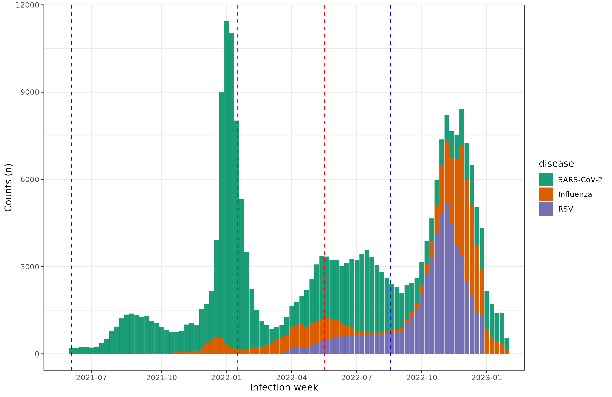
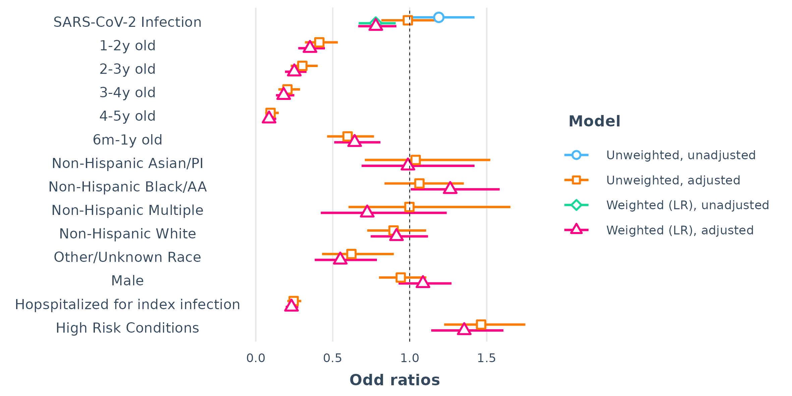
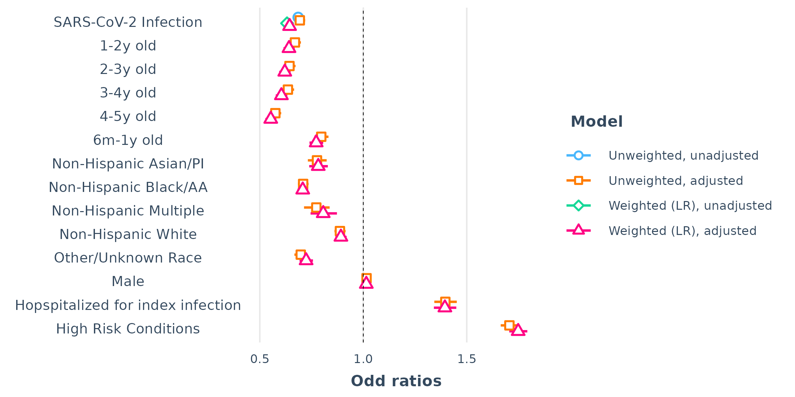
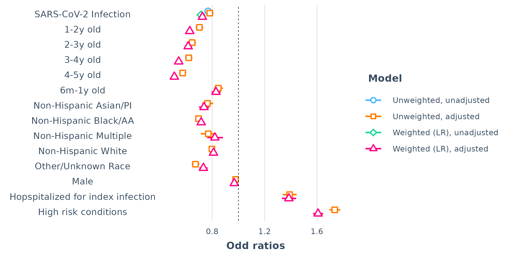
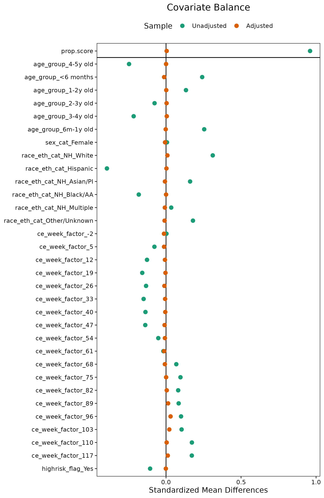
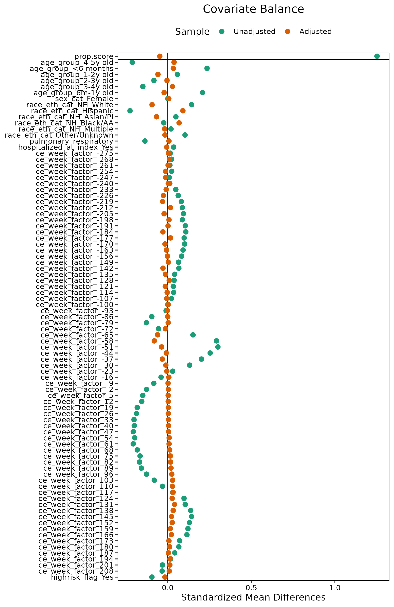
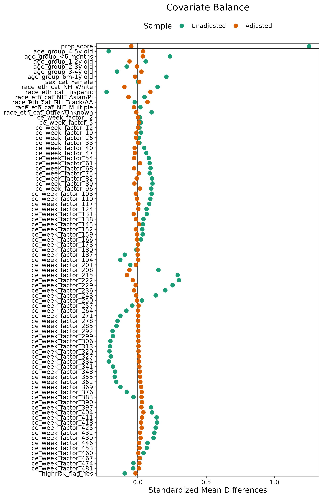

Report for progress on study modeling and analysis for the comparison of the presence of post-acute RSV infection in COVID-positive patients compared to comparison groups (influenza and other acute respiratory infections).

```{r setup_main, include=FALSE}
# Default taken from R notebook behavior: when knitting, wd will always be location of notebook
base_dir <- '..'
Sys.setenv(AWS = TRUE)
Sys.setenv(PEDSNET_SKIP_REQUEST_EXECUTION=1)
try(source('../site/run.R')) # May not be able to make db connection
#try(source('site/run.R'))

# Set to "local" to read data from ../results, or another value to read from db
data_source <- if_else(config('execution_mode') == 'distribution', 'local', 'not_local')

require(tibble)
require(knitr)
require(kableExtra)
require(readr)
require(table1)
require(ggplot2)
library(GGally)
require(tidyverse)
require(lubridate)
library(wesanderson)
library(survey)
library(survival)
library(WeightIt)
library(cobalt)
library(jtools)
require(cobalt)
require(WeightIt)
require(scattermore)
require(broom)
require(broom.mixed)
require(tableone)

get_results <- function(tbl_name) {
  if (data_source == 'local') {
    rslt <- read_csv(paste0('../results/', tbl_name, '.csv'))
  }
  else {
    rslt <- results_tbl(tbl_name) %>% collect()
  }
  return(rslt)
}


prettify_kable <- function(data, indents = list()) {
  
  if (length(indents)==0) {
      data %>% 
        kbl(digits = 2, format.args = list(big.mark = ',')) %>%
        kable_classic(full_width = F, html_font = "Arial") %>% 
        kable_styling(bootstrap_options = c("striped", "hover", "condensed")) %>% 
        column_spec(1, bold = F, border_right = T)
  } else {
      data %>% 
        kbl(digits = 2, format.args = list(big.mark = ',')) %>%
        kable_classic(full_width = F, html_font = "Arial") %>% 
        kable_styling(bootstrap_options = c("striped", "hover", "condensed")) %>% 
        add_indent(indents) %>% 
        column_spec(1, bold = F, border_right = T)
  }

  # 
  # data %>% 
  #   kable(digits = 2, format.args = list(big.mark = ',')) %>% 
  #   kable_styling(bootstrap_options = c("striped", "hover")) %>% 
  #   column_spec(1, bold = T, border_right = T)
}

my.render.cont <- function(x) {
  with(stats.apply.rounding(stats.default(x), digits = 6), c("",
    "Mean (SD)" = sprintf("%0.1f (%0.1f)", as.numeric(MEAN), as.numeric(SD)),
    "Median [Q1-Q3]" = sprintf("%0.1f [%0.1f - %0.1f]", as.numeric(MEDIAN), as.numeric(Q1), as.numeric(Q3))
  ))
}

my.render.cat <- function(x) {
  c("", sapply(stats.default(x), function(y) {
    with(
      y,
      sprintf("%s (%0.1f%%)", format(FREQ, big.mark = ","), PCT)
    )
  }))
}

pvalue <- function(x, ...) {
  # Construct vectors of data y, and groups (strata) g
  # from https://cran.r-project.org/web/packages/table1/vignettes/table1-examples.html#example-a-column-of-p-values

  y <- unlist(x)
  g <- factor(rep(1:length(x), times = sapply(x, length)))
  if (is.numeric(y)) {
    # For numeric variables, perform a standard 2-sample t-test
    p <- t.test(y ~ g)$p.value
  } else {
    # For categorical variables, perform a chi-squared test of independence
    p <- chisq.test(table(y, g))$p.value
  }
  # Format the p-value, using an HTML entity for the less-than sign.
  # The initial empty string places the output on the line below the variable label.
  c("", sub("<", "&lt;", format.pval(p, digits = 3, eps = 0.001)))
}

# fron https://rdrr.io/github/junkka/ehahelper/src/R/broom_coxme.R
tidy.coxme <- function(x, exponentiate = FALSE, conf.int = 0.95, ...) {
  beta <- x$coefficients
  nvar <- length(beta)
  nfrail <- nrow(x$var) - nvar
  nn <- c("estimate", "exp()", "std.error", "statistic", "p.value")
  se <- sqrt(diag(as.matrix(x$var))[nfrail + 1:nvar])
  z <- qnorm((1 + conf.int) / 2, 0, 1)
  ret <- data.frame(
    "term" = names(beta),
    "estimate" = beta,
    "std.error" = se,
    "statistic" = beta / se,
    "p.value" = 1 - pchisq((beta / se)^2, 1),
    "conf.low" = beta - z * se,
    "conf.high" = beta + z * se,
    "beta" = beta
  )
  if (exponentiate) {
    ret$estimate <- exp(ret$estimate)
    ret$conf.low <- exp(ret$conf.low)
    ret$conf.high <- exp(ret$conf.high)
  }
  rownames(ret) <- c(1:nrow(ret))
  ret
}
```

```{r data_resp, echo = FALSE, output = FALSE, message = FALSE , warning = FALSE}
postacute_min_start_date_resp = as.Date("2021-07-01")
postacute_max_end_date_resp = as.Date("2023-03-01")
  
cohort_entry_start_date_resp = as.Date("2021-06-01")
cohort_entry_end_date_resp = as.Date("2023-01-01")
# cohort_entry_end_date_resp = as.Date("2022-10-01")
  
cohort_1_label_resp = "resp_study"


# description = "covid_flu_3"
# description = "covid_flu_noutil"
# description = "covid_flu_util"
# description = "covid_ari_util"
# description = "covid_ari_ce_week"
# description = "covid_flu_nonexclude"

description_resp = "covid_flu_comparison"
# description = "covid_ari_comparison"
# comparison_group_string = "Respiratory"
comparison_group_string_resp = "Influenza"


analytic_dataset_resp <-
  results_tbl(paste0( cohort_1_label_resp, "_analytic_final_1")) %>% 
  # rename(ce_date = ce_date.x) %>%
  # select(-ce_date.y) %>%
  filter(ce_date >= cohort_entry_start_date_resp,
         ce_date < cohort_entry_end_date_resp)

analytic_dataset_final_resp <-
  analytic_dataset_resp %>% 
  filter(sex_cat != "Other/unknown") %>% 
  filter(is.na(covid_index_date_imputed) | covid_index_date_imputed==0) %>% 
  mutate(lab_confirmed_index = case_when( flu_type == "lab_only"~ "lab confirmed",
                                          flu_type == "dx_lab"~ "lab & diagnosis",
                                          flu_type == "dx_only" ~ "diagnosis only",
                                          lab_confirmed == 1~ "lab confirmed", 
                                          lab_confirmed == 0~ "diagnosis only",
                                          TRUE ~ NA))%>%
  # mutate(visit_span_criteria_rank = as.character(visit_span_criteria_rank)) %>% 
  mutate(hospitalized_at_index = if_else(hospital_flag==1 & visit_span_criteria_rank=="1", "Yes","No")) %>% 
  mutate(hospital_flag = as.character(hospital_flag)) %>% 
  mutate(hosp_with_vent = as.character(hosp_with_vent)) %>% 
  mutate(hospitalized_at_index = if_else(is.na(hospitalized_at_index), "No", hospitalized_at_index)) %>% 
  mutate(hosp_with_vent = ifelse(is.na(hosp_with_vent), "0", hosp_with_vent))  %>% 
  mutate(hospitalized_at_index_detail = ifelse(hospitalized_at_index== "Yes" & hosp_with_vent=="1", "Hospitalized with ventilation", hospitalized_at_index)) %>% 
  # mutate(resp_outcome_is_reinfection = case_when(resp_outcome_flu_related=="x" & sub_cohort=="Influenza" ~ "1",
  #                                                outcome_covid30d=="1" & sub_cohort=="COVID" ~ "1",
  #                                                TRUE ~ "0")) %>% 
  # mutate(rsv_outcome_postacute = ifelse(rsv_occurrence_period == "post acute (15-180 days after index)", 1, 0)) %>% 
  collect()

# visit_counts_resp <- results_tbl(paste0(cohort_1_label_resp, "_visit_lookback_counts")) %>%
#   collect()

```

```{r data_RSV, include = FALSE, echo=FALSE, message=FALSE, warning=FALSE}

postacute_min_start_date = as.Date("2022-04-01")
postacute_max_end_date = as.Date("2023-01-01")

cohort_entry_start_date = as.Date("2022-03-01")
cohort_entry_end_date = as.Date("2022-07-01")

cohort_1_label = "rsv_study"

comparison_group_string = "Influenza"


analytic_dataset <-
  results_tbl(paste0(cohort_1_label, "_analytic_final")) %>%
  # rename(ce_date = ce_date.x) %>%
  # select(-ce_date.y) %>%
  filter(ce_date >= cohort_entry_start_date,
         ce_date < cohort_entry_end_date) %>% collect()

analytic_dataset_final <-
  analytic_dataset %>% 
  filter(sex_cat != "Other/unknown") %>% 
  filter(is.na(covid_index_date_imputed) | covid_index_date_imputed==0) %>% 
  group_by(person_id) %>% 
  mutate(exclude = max(exclude_for_prior_rsv)) %>% 
  filter(exclude < 1) %>%
  slice_min(rsv_evidence_date, with_ties=FALSE) %>% 
  ungroup() %>% 
  mutate(lab_confirmed_index = case_when( flu_type == "lab_only"~ "lab confirmed",
                                          flu_type == "dx_lab"~ "lab & diagnosis",
                                          flu_type == "dx_only" ~ "diagnosis only",
                                          lab_confirmed == 1~ "lab confirmed", 
                                          lab_confirmed == 0~ "diagnosis only",
                                          TRUE ~ NA))%>%
  #mutate(lab_confirmed_index = ifelse(lab_confirmed==1, "lab confirmed", "dx only"))%>% 
  #mutate(lab_confirmed_index =ifelse(flu_type == "lab_only"| flu_type =="dx_lab" ,"lab confirmed",lab_confirmed_index))%>%
  mutate(lab_confirmed_rsv_outcome = ifelse(lab_confirmed_rsv==1, "lab confirmed RSV", "dx only")) %>% 
  # mutate(visit_span_criteria_rank = as.character(visit_span_criteria_rank)) %>% 
  mutate(hospitalized_at_index = ifelse(hospital_flag==1 & visit_span_criteria_rank=="1", "Hospitalized", "Not hospitalized")) %>% 
  mutate(hospital_flag = as.character(hospital_flag)) %>% 
  mutate(hosp_with_vent = as.character(hosp_with_vent)) %>% 
  mutate(hospitalized_at_index = ifelse(is.na(hospitalized_at_index), "Not hospitalized", hospitalized_at_index)) %>% 
  mutate(hosp_with_vent = ifelse(is.na(hosp_with_vent), "0", hosp_with_vent))  %>% 
  mutate(hospitalized_at_index_detail = ifelse(hospitalized_at_index=="Hospitalized" & hosp_with_vent=="1", "Hospitalized with ventilation", hospitalized_at_index)) %>% collect() %>%
  mutate(pulmonary_respiratory = as.factor(pulmonary_respiratory),
          highrisk_flag = if_else(highrisk_flag, "Yes", "No"))


# visit_counts <- results_tbl(paste0(cohort_1_label, "_visit_lookback_counts")) %>% 
#   collect()

```

# Main analysis: Any respiratory infection analysis (original aim 2&3) 
## Supplemental Table 5a : attitrion talble for a) main cohort evaluating the outcome of any respiratory infection

This attrition table considers the cohort entry period to be defined from *June 1, 2021* to *March 1, 2023*. 
This means that the study outcome window will extend from *July 1, 2021* to *March 1, 2023*.


Attrition based on cohort inclusion criteria. Inclusion criteria were computed according to the following rules.

* Patients under 6 years old with at least one visit during cohort entry period (June 1, 2021 to February 01, 2023 may be tightened as desired)

* Had evidence of either SARS-CoV-2 infection or Influenza infection within the cohort entry period

* Had at least 1 visit within 18 months of index date, and at least 1 visit in the 1-6 months following the index date (follow up period)


* Exclusions:

  * No prior SARS-CoV-2 ever, via test, diagnosis, or serology positive
  
  * No Influenza within pre-acute or acute period (6 months before index)
  
  * No prior RSV (outcome) or RSV within acute period
  
  * No co-infection of Influenza and SARS-Cov-2 within acute period

  * <span style="background-color: #FFFF00">For influenza index infections, no other respiratory infection positive tests within 14 days of index date</span>. Other respsiratory infections include: 
      * Adenovirus
      * Coronavirus 229E, HKU1, NL63, OC43
      * Human Metapneumovirus
      * Human Rhinovirus/Enterovirus
      * Influenza A virus A/H1, A/H3, A/H1-2009
      * Influenza B virus
      * Parainfluenza virus 1, 2, 3, 4
      * Respiratory syncytial virus
      * Bordetella parapertussis
      * Bordetella pertussis
      * Chlamydia pneumoniae
      * Mycoplasma pneumoniae

```{r attrition_resp, echo=FALSE, message=FALSE, warning=FALSE, paged.print=FALSE, fig.width=8, fig.height=6}
attrition_resp <- results_tbl(paste0(cohort_1_label_resp, "_attrition")) %>% 
  collect()

attrition_ordered_resp <- attrition_resp %>% 
  mutate(ordering = case_when(
    cohort == "Patients under 6 years old with at least 1 visit during CE period" ~ 1,
    cohort == "Had at least 1 of COVID, influenza infection event during CE period" ~ 2,
    cohort == "Had COVID during CE period" ~ 3,
    cohort == "Had influenza during CE period" ~ 4,
    cohort == "Meets utilization inclusion criteria" ~ 5,
    cohort == "Overall cohort without overlapping index infections" ~ 6,
    cohort == "COVID sub-cohort" ~ 7,
    cohort == "Influenza sub-cohort" ~ 8,
    cohort == "Overall cohort without invalid gender and co-infections" ~ 9,
    cohort == "Final COVID sub-cohort" ~ 10,
    cohort == "Final Influenza sub-cohort" ~ 11,
    #cohort == "Final Other respiratory sub-cohort" ~ 10,
    TRUE ~ 0
  ))


attrition_ordered_resp %>%
  select("Attrition step" = cohort, persons, ordering) %>%
  filter(ordering > 0) %>%
  arrange(ordering) %>%
  select(-ordering) %>%
  prettify_kable(c(3, 4, 7, 8, 10, 11))
```

## Table 1: Sociodemographic characteristics of study population
```{r table1_resp, echo=FALSE, message=FALSE, warning=FALSE, paged.print=FALSE, fig.width=8, fig.height=6}
  
table1_resp <- analytic_dataset_final_resp %>% 
                mutate(age_cat_at_ce = factor(age_cat_at_ce, levels = c("<6 months", "6m-1y old", "1-2y old", "2-3y old", "3-4y old", "4-5y old")),
                       race_eth_cat = recode(race_eth_cat, "NH_White" = "Non-Hispanic White", 
                                                           "NH_Asian/PI" = "Non-Hispanic Asian/PI",
                                                           "NH_Black/AA" = "Non-Hispanic Black",
                                                           "NH_Multiple" = "Non-Hispanic Multiple"), 
                       insurance_class = recode(insurance_class, "private" = "Private", "public" = "Public", "other/unknown" = "Other"),
                       insurance_class = factor(insurance_class, levels = c("Public", "Private", "Other")),
                       across(c("util_inpatient", "util_outpatient", "util_ed", "util_other"), ~recode(.x, "high_utilizer" = "High Utilizer", 
                                                                "low_utilizer" = "Low Utilizer", 
                                                                "moderate_utilizer" = "Moderate Utilizer", 
                                                                "no_visits" = "No Visits")), 
                       across(c("util_inpatient", "util_outpatient", "util_ed", "util_other"), ~factor(.x, levels = c("High Utilizer", "Moderate Utilizer", "Low Utilizer", "No Visits"))), 
                       pulmonary_respiratory = as.factor(pulmonary_respiratory),
                       pulmonary_respiratory = if_else(pulmonary_respiratory == 1, "Yes" ,  "No"))
label(table1_resp$age_cat_at_ce) = "Age categories"
label(table1_resp$sex_cat) = "Gender"
label(table1_resp$race_eth_cat) = "Race/ethnicity"
label(table1_resp$insurance_class) = "Insurance class"
label(table1_resp$util_inpatient) = "Prior inpatient visit frequency*"
label(table1_resp$util_outpatient) = "Prior outpatient visit frequency*"
label(table1_resp$util_ed) = "Prior ED visit frequency*"
label(table1_resp$util_other) = "Prior other visit frequency*"
label(table1_resp$lab_confirmed_index) = "Test confirm diagnosis"
label(table1_resp$highrisk_flag )=  "Had at least one high risk condition"
label(table1_resp$hospitalized_at_index) = "Hospitalized at index visit"
label(table1_resp$pulmonary_respiratory )=  "PMCA**"
table1(~ age_cat_at_ce + 
         sex_cat + race_eth_cat + 
         insurance_class + 
         util_inpatient +
         util_outpatient +
         util_ed + 
         util_other +
         #visit_type_inpatient +
         #visit_type_outpatient +
         #visit_type_ed + 
         #visit_type_other +
         lab_confirmed_index +
         hospitalized_at_index  +
         #hospitalized_at_index_detail +
         pulmonary_respiratory + highrisk_flag | sub_cohort,
       data = table1_resp,
       footnote = c("PI: Pacific Islander", 
                "*Low, moderate, and high utilizers correspond to the 33th, 66th, and 97.5th percentile of the number of visits in the cohort",
                "**With a 3 year lookback period"))
```

## Patient counts by sites --- any respiratory outcomes

```{r sub_cohort_ct_by_sites_resp, echo=FALSE, message=FALSE, warning=FALSE, paged.print=FALSE, fig.width=15, fig.height=10}
resp_by_ce_yr <- analytic_dataset_final_resp %>% select(person_id, sub_cohort, lab_confirmed_index, ce_date) %>%
  copy_to_new(df=., name = "analytic_dataset_final") %>%
  inner_join(cdm_tbl("person") %>% select(person_id, site), by = "person_id") %>%
  mutate(ce_yr = year(ce_date)) %>%
  # mutate(observation_yr = year(observation_date)) %>%
  mutate(lab_confirmed_index = ifelse(sub_cohort == "Influenza" & lab_confirmed_index == "lab & diagnosis", "lab confirmed", lab_confirmed_index))%>%
  group_by(site, sub_cohort, lab_confirmed_index,ce_yr) %>%
  summarise(n = n_distinct(person_id)) %>% ungroup() %>% collect_new() %>%
  mutate(ce_yr = factor(ce_yr))

resp_by_site <- resp_by_ce_yr %>% #analytic_dataset_final %>% select(person_id, sub_cohort, lab_confirmed_index) %>%
#   copy_to_new(df=., name = "analytic_dataset_final") %>%
#   inner_join(cdm_tbl("person") %>% select(person_id, site), by = "person_id") %>%
  group_by(site, sub_cohort, lab_confirmed_index) %>%
  summarise(n = sum(n)) %>% ungroup() 

# rsv_by_site %>% group_by(site, sub_cohort) %>%
#   filter(sub_cohort == "COVID")%>%
#   mutate(ct = sum(n)) %>%
#   mutate(perc = round(n/ct*100, 2)) %>%
#   ggplot(aes(x = site, y = perc, color = site, fill = site))+
#   geom_col(position = "identity") +
#   facet_wrap(~lab_confirmed_index, ncol = 2)+
#   labs(title = "Proportion of lab-confirmed and diagnosis cases for COVID sub-cohort by sites")+ 
#   theme(axis.text.x = element_text(angle = 45, vjust = 0.5, hjust=1))
  
resp_by_ce_yr %>% group_by(site, sub_cohort) %>%
  filter(sub_cohort == "COVID")%>%
  mutate(ct = sum(n)) %>%
  mutate(perc = round(n/ct*100, 2)) %>%
  ggplot(aes(x = site, y = perc, color = site, fill = site))+
  geom_col(position = "identity") +
  facet_wrap(~lab_confirmed_index+ce_yr, ncol = 2)+
  labs(title = "Proportion of lab-confirmed and diagnosis cases for COVID sub-cohort by sites")+ 
  theme(axis.text.x = element_text(angle = 45, vjust = 0.5, hjust=1)) 

resp_by_ce_yr %>% 
  group_by(site, sub_cohort) %>%
  filter(sub_cohort == "Influenza")%>%
  mutate(ct = sum(n)) %>%
  mutate(perc = round(n/ct*100, 2)) %>%
  ggplot(aes(x = site, y = perc, color = site, fill = site))+
  geom_col(position = "identity") +
  facet_wrap(~lab_confirmed_index+ce_yr, ncol = 2)+
  labs(title = "Proportion of lab-confirmed and diagnosis cases for Influenza sub-cohort by sites")+ 
  theme(axis.text.x = element_text(angle = 45, vjust = 0.5, hjust=1)) 

```


# Sensitivity analysis: RSV infection outcome (original aim 1)
## Supplemental Table 5b: Attrition Table for b) subcohort evaluating the outcome of RSV infection

This attrition table considers the cohort entry period to be defined from *March 1, 2022* to *July 1, 2022*. 
This means that the study outcome window will extend from *April 1, 2022* to *January 1, 2023*.


Attrition based on cohort inclusion criteria. Inclusion criteria were computed according to the following rules.

* Patients under 6 years old with at least one visit during cohort entry period (Jan 1 - July 1, 2022, may be tightened as desired)

* Had evidence of either SARS-CoV-2 infection, Influenza, or any other respiratory infection within the cohort entry period

* Had at least 1 visit within 18 months of index date, and at least 1 visit in the 1-6 months following the index date (follow up period)

Index sub-cohort group was selected according to the following logic:

* Select as initial index type and date the *earliest evidence of SARS-CoV-2 or Influenza or other ARI*

* If a patient's index category is an *other ARI* but they *have evidence of SARS-CoV-2 or Influenza within 7 days*, update the index category to SARS-CoV-2/Influenza accordingly, but keep the index date the same as the preliminary ARI diagnosis

* Exclusions:

  * No prior SARS-CoV-2 ever, via test, diagnosis, or serology positive
  
  * No Influenza within pre-acute or acute period (6 months before index)
  
  * No prior RSV (outcome) or RSV within acute period
  
  * No co-infection of Influenza and SARS-Cov-2 within acute period
  
  * <span style="background-color: #FFFF00">For influenza index infections, no other respiratory infection positive tests within 14 days of index date</span>. Other respsiratory infections include: 
      * Adenovirus
      * Coronavirus 229E, HKU1, NL63, OC43
      * Human Metapneumovirus
      * Human Rhinovirus/Enterovirus
      * Influenza A virus A/H1, A/H3, A/H1-2009
      * Influenza B virus
      * Parainfluenza virus 1, 2, 3, 4
      * Respiratory syncytial virus
      * Bordetella parapertussis
      * Bordetella pertussis
      * Chlamydia pneumoniae
      * Mycoplasma pneumoniae

```{r attrition_rsv, echo=FALSE, message=FALSE, warning=FALSE, paged.print=FALSE, fig.width=8, fig.height=6}
attrition <- results_tbl(paste0(cohort_1_label, "_attrition")) %>% 
  collect()

attrition_ordered <- attrition %>% 
  distinct(cohort, persons) %>%
  mutate(ordering = case_when(
    cohort == "Patients under 6 years old with at least 1 visit during CE period" ~ 1,
    cohort == "Had at least 1 of COVID, influenza, and/or other respiratory infection event during CE period" ~ 2,
    cohort == "Had COVID during CE period" ~ 3,
    cohort == "Had influenza during CE period" ~ 4,
    cohort == "Had other respiratory infection during CE period" ~ 5,
    cohort == "Meets utilization inclusion criteria" ~ 6,
    cohort == "Overall cohort without overlapping index infections" ~ 7,
    cohort == "COVID sub-cohort" ~ 8,
    cohort == "Influenza sub-cohort" ~ 9,
    cohort == "Other respiratory infection sub-cohort" ~ 10, 
    cohort == "Overall cohort without invalid gender and co-infections" ~ 11, 
    cohort == "Final COVID sub-cohort" ~ 12, 
    cohort == "Final Influenza sub-cohort" ~ 13, 
    cohort == "Final Respiratory sub-cohort" ~ 14, 
    TRUE ~ 0
  ))


attrition_ordered %>%
  select("Attrition step" = cohort, persons, ordering) %>%
  filter(ordering > 0) %>%
  arrange(ordering) %>%
  select(-ordering) %>%
  prettify_kable(c(3, 4, 5, 8, 9, 10, 12, 13, 14))
```


## Supplemental Table 6: Sociodemographic characteristics of study subcohort used for RSV analyses

```{r table1_rsv, echo=FALSE, message=FALSE, warning=FALSE, paged.print=FALSE, fig.width=8, fig.height=6}
table1_rsv <- analytic_dataset_final %>% 
                mutate(age_cat_at_ce = factor(age_cat_at_ce, levels = c("<6 months", "6m-1y old", "1-2y old", "2-3y old", "3-4y old", "4-5y old")),
                       race_eth_cat = recode(race_eth_cat, "NH_White" = "Non-Hispanic White", 
                                                           "NH_Asian/PI" = "Non-Hispanic Asian/PI",
                                                           "NH_Black/AA" = "Non-Hispanic Black",
                                                           "NH_Multiple" = "Non-Hispanic Multiple"), 
                       insurance_class = recode(insurance_class, "private" = "Private", "public" = "Public", "other/unknown" = "Other"),
                       insurance_class = factor(insurance_class, levels = c("Public", "Private", "Other")),
                       across(c("util_inpatient", "util_outpatient", "util_ed", "util_other"), ~recode(.x, "high_utilizer" = "High Utilizer", 
                                                                "low_utilizer" = "Low Utilizer", 
                                                                "moderate_utilizer" = "Moderate Utilizer", 
                                                                "no_visits" = "No Visits")), 
                       across(c("util_inpatient", "util_other"), ~factor(.x, levels = c("High Utilizer", "Low Utilizer", "No Visits"))), 
                       across(c("util_outpatient", "util_ed"), ~factor(.x, levels = c("High Utilizer", "Moderate Utilizer", "Low Utilizer", "No Visits"))) )%>%
  mutate(hospitalized_at_index = if_else(hospitalized_at_index == "Not hospitalized", "No", "Yes"),
         pulmonary_respiratory = if_else(pulmonary_respiratory == 1, "Yes" ,  "No"))
label(table1_rsv$age_cat_at_ce) = "Age categories"
label(table1_rsv$sex_cat) = "Gender"
label(table1_rsv$race_eth_cat) = "Race/ethnicity"
label(table1_rsv$insurance_class) = "Insurance class"
label(table1_rsv$util_inpatient) = "Prior inpatient visit frequency*"
label(table1_rsv$util_outpatient) = "Prior outpatient visit frequency*"
label(table1_rsv$util_ed) = "Prior ED visit frequency*"
label(table1_rsv$util_other) = "Prior other visit frequency*"
label(table1_rsv$lab_confirmed_index) = "Test confirm diagnosis"
label(table1_rsv$highrisk_flag )=  "Had at least one high risk condition"
label(table1_rsv$pulmonary_respiratory )=  "PMCA**"
label(table1_rsv$hospitalized_at_index )=  "Hospitalized for index infection"
table1(~ age_cat_at_ce + 
         sex_cat + race_eth_cat + 
         insurance_class + 
         util_inpatient +
         util_outpatient +
         util_ed + 
         util_other +
         lab_confirmed_index +
         hospitalized_at_index + 
         pulmonary_respiratory + 
         highrisk_flag | sub_cohort, 
       data = table1_rsv,
       footnote = c("PI: Pacific Islander", 
                    "*Low, moderate, and high utilizers correspond to the 33th, 66th, and 97.5th percentile of the number of visits in the cohort",
                    "**With a 3 year lookback period"))
```

## Patient counts by sites --- RSV outcomes
```{r sub_cohort_ct_by_sites_rsv,echo=FALSE, message=FALSE, warning=FALSE, paged.print=FALSE,  fig.width=15, fig.height=10}
rsv_by_ce_yr <- analytic_dataset_final %>% select(person_id, sub_cohort, lab_confirmed_index, ce_date) %>%
  copy_to_new(df=., name = "analytic_dataset_final") %>%
  inner_join(cdm_tbl("person") %>% select(person_id, site), by = "person_id") %>%
  mutate(ce_yr = year(ce_date)) %>%
  mutate(lab_confirmed_index = ifelse(sub_cohort == "Influenza" & lab_confirmed_index == "lab & diagnosis", "lab confirmed", lab_confirmed_index))%>%
  group_by(site, sub_cohort, lab_confirmed_index, ce_yr) %>%
  summarise(n = n_distinct(person_id)) %>% ungroup() %>% collect_new() %>%
  mutate(ce_yr = factor(ce_yr))

rsv_by_site <- rsv_by_ce_yr %>% #analytic_dataset_final %>% select(person_id, sub_cohort, lab_confirmed_index) %>%
#   copy_to_new(df=., name = "analytic_dataset_final") %>%
#   inner_join(cdm_tbl("person") %>% select(person_id, site), by = "person_id") %>%
  group_by(site, sub_cohort, lab_confirmed_index) %>%
  summarise(n = sum(n)) %>% ungroup() 

# rsv_by_site %>% group_by(site, sub_cohort) %>%
#   filter(sub_cohort == "COVID")%>%
#   mutate(ct = sum(n)) %>%
#   mutate(perc = round(n/ct*100, 2)) %>%
#   ggplot(aes(x = site, y = perc, color = site, fill = site))+
#   geom_col(position = "identity") +
#   facet_wrap(~lab_confirmed_index, ncol = 2)+
#   labs(title = "Proportion of lab-confirmed and diagnosis cases for COVID sub-cohort by sites")+ 
#   theme(axis.text.x = element_text(angle = 45, vjust = 0.5, hjust=1))
  
rsv_by_ce_yr %>% group_by(site, sub_cohort) %>%
  filter(sub_cohort == "COVID")%>%
  mutate(ct = sum(n)) %>%
  mutate(perc = round(n/ct*100, 2)) %>%
  ggplot(aes(x = site, y = perc, color = site, fill = site))+
  geom_col(position = "identity") +
  facet_wrap(~lab_confirmed_index+ce_yr, ncol = 2)+
  labs(title = "Proportion of lab-confirmed and diagnosis cases for COVID sub-cohort by sites")+ 
  theme(axis.text.x = element_text(angle = 45, vjust = 0.5, hjust=1)) 

rsv_by_ce_yr %>% 
  group_by(site, sub_cohort) %>%
  filter(sub_cohort == "Influenza")%>%
  mutate(ct = sum(n)) %>%
  mutate(perc = round(n/ct*100, 2)) %>%
  ggplot(aes(x = site, y = perc, color = site, fill = site))+
  geom_col(position = "identity") +
  facet_wrap(~lab_confirmed_index+ce_yr, ncol = 2)+
  labs(title = "Proportion of lab-confirmed and diagnosis cases for Influenza sub-cohort by sites")+ 
  theme(axis.text.x = element_text(angle = 45, vjust = 0.5, hjust=1)) 

rsv_by_ce_yr %>% 
  group_by(site, sub_cohort) %>%
  filter(sub_cohort == "Respiratory")%>%
  mutate(ct = sum(n)) %>%
  # mutate(perc = round(n/ct*100, 2)) %>%
  ggplot(aes(x = site, y = ct, color = site, fill = site))+
  geom_col(position = "identity") +
  facet_wrap(~lab_confirmed_index+ce_yr, ncol = 2)+
  labs(title = "Number of diagnosis cases for Respiratory sub-cohort by sites")+ 
  theme(axis.text.x = element_text(angle = 45, vjust = 0.5, hjust=1)) 
```

# Figure 1: Epi curve 

```{r figure_1_epi_curve, message=FALSE, warning=FALSE, fig.width=8, fig.height=6}
```

# Table 6: Co-infection tables
```{r table_6_coinfection, echo = FALSE, message=FALSE, warning=FALSE, fig.width=8, fig.height=6}
fig6_tbl <- analytic_dataset_final %>% 
  group_by(sub_cohort, outcome_rsv_same_day, outcome_rsv_1_to_60, outcome_rsv_61_to_180) %>% 
  summarise(n = n_distinct(person_id)) %>% 
  ungroup() %>% 
  group_by(sub_cohort) %>% 
  mutate(total = sum(n)) %>% 
  mutate(p = n/total) %>% 
  mutate(pct = paste0(as.character(round(p*100, 2)), " %")) %>% 
  ungroup() %>%
  filter(outcome_rsv_same_day !=0 | outcome_rsv_1_to_60 !=0 | outcome_rsv_61_to_180 != 0)

fig6_tbl %>% filter(sub_cohort != "Respiratory") %>% mutate(cohort = factor(case_when(outcome_rsv_same_day==1 ~ "RSV infection on the same date as index infection", 
                                                                       outcome_rsv_1_to_60 ==1 ~ "RSV infection within 1 to 60 days from index infection",
                                                                       outcome_rsv_61_to_180 ==1 ~ "RSV infection within 61 to 180 days from index infection",
                                                                       TRUE ~ NA), 
                                                              levels = c("RSV infection on the same date as index infection", 
                                                                         "RSV infection within 1 to 60 days from index infection",
                                                                         "RSV infection within 61 to 180 days from index infection")))%>%
                        mutate(label = paste0(n, " (", pct, ")")) %>%
                        select(sub_cohort, cohort, label) %>% prettify_kable()
```

# Figure 2: Odds ratios of unweighted, weighted, adjusted and unadjusted models

Footnote: Square and triangle shapes represent odds ratios, lines represent 95% confidence intervals. Each color represents a different model with varied time period of evaluation, weighting and adjustment. Models adjusted for age, sex, ethnicity, prior inpatient visit frequency*, prior outpatient visit frequency, prior emergency visit frequency, Hospitalization at index infection, and **high risk condition**. 


## Figure 2a RSV infection in in the 15-180 days following SARS-CoV-2 infection compared with following influenza infection



```{r fig_2a_1period, echo=FALSE, message=FALSE, warning=FALSE, paged.print=FALSE, fig.width=8}
models_highrisk_2a = list()
outcome_15_180 = "outcome_rsv_15_to_180"
formula_no_pulmonary = "~ covid+ age_group + race_eth_cat + sex_cat + hospitalized_at_index +  util_inpatient +  util_outpatient +  util_ed + util_other"

df_15_180_highrisk <- results_tbl( paste0("covid_flu_outcome_rsv_15_180_highrisk",'_tabc')) %>%
  collect()

models_highrisk_2a$unw_adj_15_to_180 <- run_logistic_regression(df = df_15_180_highrisk,
                                                                model_formula = paste0(outcome_15_180, formula_no_pulmonary, "+ highrisk_flag"),
                                                                weight_method = "none")

models_highrisk_2a$w_unadj_15_to_180 <- run_logistic_regression(df = df_15_180_highrisk,
                                                                model_formula = paste0(outcome_15_180,
                                                                                       "~ covid"),
                                                                weight_method = "lr")
models_highrisk_2a$unw_unadj_15_to_180 <- run_logistic_regression(df = df_15_180_highrisk,
                                                                  model_formula = paste0(outcome_15_180, " ~ covid"),
                                                                  weight_method = "none")
models_highrisk_2a$w_adj_15_to_180 <- run_logistic_regression(df = df_15_180_highrisk,
                                                              model_formula = paste0(outcome_15_180,
                                                                                     formula_no_pulmonary, "+ highrisk_flag"),
                                                              weight_method = "lr")

export_summs(models_highrisk_2a$unw_unadj_15_to_180,
             models_highrisk_2a$unw_adj_15_to_180,
             models_highrisk_2a$w_unadj_15_to_180,
             models_highrisk_2a$w_adj_15_to_180,
             model.names = c("Unweighted, unadjusted",
                             "Unweighted, adjusted",
                             "Weighted (LR), unadjusted",
                             "Weighted (LR), adjusted"),
             # "Weighted, adjusted for CE week"),
             exp = TRUE,
             error_format = "[{conf.low}, {conf.high}]")
```

## Figure 2b any respiratory infection in the 30 to 180 days following SARS-CoV-2 infection compared with following influenza infection


```{r fig_2b, echo=FALSE, message=FALSE, warning=FALSE, paged.print=FALSE, fig.width=8}

outcome_ari = "resp30d_or_covid30d"
comparison_group_ari = "Influenza"

formula_no_pulmonary = "~ covid+ age_group + race_eth_cat + sex_cat + hospitalized_at_index +  util_inpatient +  util_outpatient +  util_ed + util_other"

dataset_iptw_ari <- results_tbl( paste0("resp_notime_w_flu_resp30d_highrisk",'_tabc')) %>%
  collect()

models_ari_2b = list()

models_ari_2b$model_unweighted_unadjusted <- run_logistic_regression(df = dataset_iptw_ari,
                                                       model_formula = paste0(outcome_ari, " ~ covid"),
                                                       weight_method = "none")

models_ari_2b$model_unweighted_adjusted <- run_logistic_regression(df = dataset_iptw_ari,
                                                         model_formula = paste0(outcome_ari,
                                                                               formula_no_pulmonary, " + highrisk_flag"),
                                                         weight_method = "none")

models_ari_2b$model_weighted_unadjusted <- run_logistic_regression(df = dataset_iptw_ari,
                                                       model_formula = paste0(outcome_ari, " ~ covid"),
                                                       weight_method = "lr_s")

# # TODO something is wrong with inpatient
models_ari_2b$model_weighted_adjusted <- run_logistic_regression(df = dataset_iptw_ari,
                                                         model_formula = paste0(outcome_ari,
                                                                                formula_no_pulmonary, " + highrisk_flag"),
                                                         weight_method = "lr_s")

export_summs(models_ari_2b$model_unweighted_unadjusted,
           models_ari_2b$model_unweighted_adjusted,
           models_ari_2b$model_weighted_unadjusted,
           models_ari_2b$model_weighted_adjusted,
           # models$model_weighted_adjusted_time,
           model.names = c("Unweighted, unadjusted",
                           "Unweighted, adjusted",
                           "Weighted (LR), unadjusted",
                           "Weighted (LR), adjusted"),
                           # "Weighted, adjusted for CE week"),
           exp = TRUE,
           error_format = "[{conf.low}, {conf.high}]")
```

## Figure 2c any infection in the 30 to 180 days following SARS-CoV-2 infection compared with following influenza infection

```{r fig_2c, echo=FALSE, message=FALSE, warning=FALSE, paged.print=FALSE, fig.width=8}
models_highrisk_2c = list()

outcome = "outcome_general30d"
comparison_group = "Influenza"

dataset_with_iptw <- results_tbl( paste0("resp_study_covid_flu_general30d_highrisk", '_tabc')) %>%
  collect()

models_highrisk_2c$model_unweighted_unadjusted <- run_logistic_regression(df = dataset_with_iptw,
                                                                          model_formula = paste0(outcome, " ~ covid"),
                                                                          weight_method = "none")

models_highrisk_2c$model_unweighted_adjusted <- run_logistic_regression(df = dataset_with_iptw,
                                                                        model_formula = paste0(outcome,
                                                                                               formula_no_pulmonary, " + highrisk_flag"), 
                                                                        weight_method = "none")

models_highrisk_2c$model_weighted_unadjusted <- run_logistic_regression(df = dataset_with_iptw,
                                                                        model_formula = paste0(outcome, " ~ covid"),
                                                                        weight_method = "lr")

models_highrisk_2c$model_weighted_adjusted <- run_logistic_regression(df = dataset_with_iptw,
                                                                      model_formula = paste0(outcome,
                                                                                             formula_no_pulmonary, " + highrisk_flag"), 
                                                                      weight_method = "lr")


export_summs(models_highrisk_2c$model_unweighted_unadjusted,
           models_highrisk_2c$model_unweighted_adjusted,
           models_highrisk_2c$model_weighted_unadjusted,
           models_highrisk_2c$model_weighted_adjusted,
           # models$model_weighted_adjusted_time,
           model.names = c("Unweighted, unadjusted",
                           "Unweighted, adjusted",
                           "Weighted (LR), unadjusted",
                           "Weighted (LR), adjusted"),
                           # "Weighted, adjusted for CE week"),
           exp = TRUE,
           error_format = "[{conf.low}, {conf.high}]")
```

# Figure S3: Results of IPTW illustrating the balance achieved when using propensity score weighting to reduce confounding of covariates with the exposure (SARS-Cov-2 infection compared to influenza
- Footnote: The propensity weighting accounts for age,  sex, ethnicity, time of index infection and **high risk conditions**.

## Figure S3_a: RSV outcome


## Figure S3_b: Respiratory infection outcome 


## Figure S3_c: Any infection outcome



